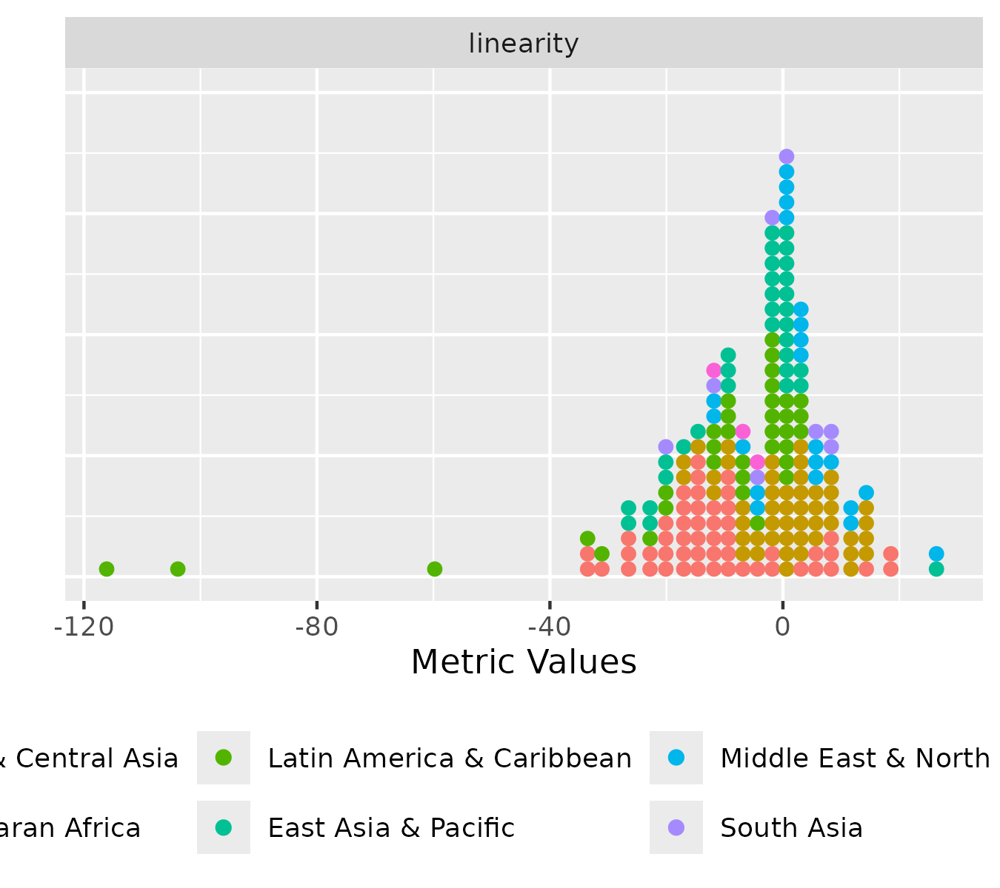
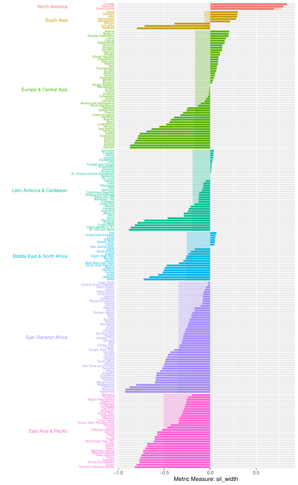
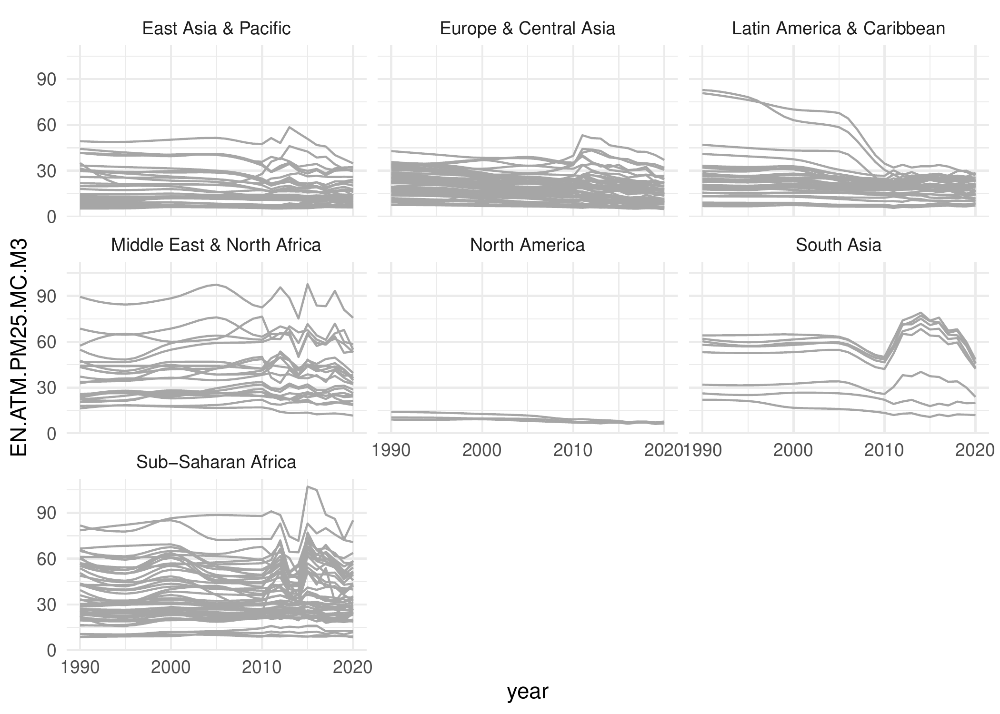
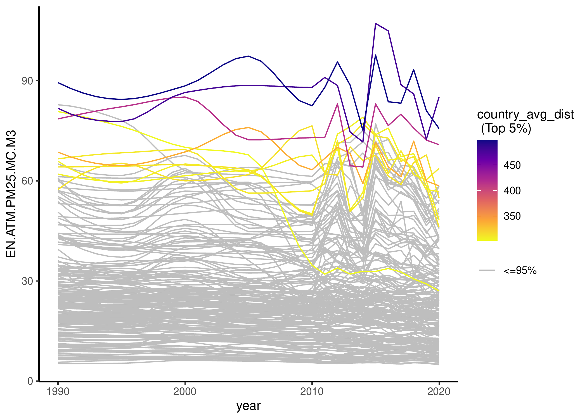

# wdiexplorer <a href="https://github.com/Oluwayomi-Olaitan/wdiexplorer"></a>

The `wdiexplorer` package provides a collection of indices and visualisation tools for exploratory analysis of country-level panel data from the World Development Indicators (WDI, [the world bank collection of development indicators](https://databank.worldbank.org/home.aspx)) using the `WDI` R package to effectively source and store the data locally. 
The package name is an acronym that captures its core functionality: World Development Indicators Explorer.

There are two main goals of the `wdiexplorer` package:

1. A collection of diagnostic indices that characterise panel data behaviour.

2. Group-informed exploration of country-level panel data that leverage the pre-defined groupings of the data through interactive visuals to capture behavioural patterns and highlight group-based features.
World Development Indicators Explorer in R

## Installation

You can install the `wdiexplorer` package from [GitHub](https://github.com/Oluwayomi-Olaitan/wdiexplorer)

``` r
#install.packages("devtools")

#devtools::install_github(Oluwayomi-Olaitan/wdiexplorer)

library(wdiexplorer)

```

### Stage 1: Data Sourcing and Preparation

To load any WDI indicator data of choice, our function `get_wdi_data` is designed to retrieve data from the WDI R package. 
The `get_wdi_data` function takes a single argument named `indicator`, which should be a valid code (e.g., In one of the vignettes, we use the PM2.5 air pollution data with WDI indicator code: "EN.ATM.PM25.MC.M3").

You can find indicator codes by using the `WDI::WDISearch()` function in R, as illustrated below.

``` r
WDI::WDIsearch("air pollution")

#pm_data <- get_wdi_data(indicator = "EN.ATM.PM25.MC.M3")
```

A missingness plot of the PM2.5 air pollution data

``` r
plot_missing(wdi_data = pm_data, group_var = "region")
```

In addition, the `wdiexplorer` package provides the `get_valid_data` function, which reports countries with no data points as well as years for which no data are available, and returns a tibble with the valid data for the provided WDI indicator dataset.

``` r
get_valid_data(pm_data)
```

This plot provides information about the years and countries with missing entries and the overall percentages of missing and present data.

### Stage 2: Diagnostic indices

This second stage of the workflow focuses on calculating the diagnostic indices. They measure variation, trend and shape features, as well as sequential temporal characteristics.
Each group has its own function that returns features specific to that group, while a combined function, `compute_diagnostic_indices`, computes all ten diagnostic indices collectively.

``` r
pm_diagnostic_metrics <- compute_diagnostic_indices(pm_data, group_var = "region")
```

Our plot function requires a grouping variable. Hence, we introduce `add_group_info` function to append the pre-defined grouping information from the WDI data set to the data frame of any computed diagnostics function output.

``` r
pm_diagnostic_metrics_group <- add_group_info(
                    metric_summary = pm_diagnostic_metrics,
                    pm_data
            )
```

### Stage 3: Static and Interactive Visualisations

The third stage of the workflow utilises visual summaries to detect potentially interesting features within panel data.

``` r
plot_metric_distribution(
        metric_summary = pm_diagnostic_metrics_group, 
        metric_var = "linearity",
        colour_var = "region"
    )
```

<!-- -->

The distribution plot displays the distribution of metric values, either for all diagnostic indices or for a selected metric (one or multiple). It summarises the variation of metric values by showing the spread and shape of their distributions. 
There are two versions of the distribution plot: an ungrouped version, which shows the values of one or more metrics across all countries, and a grouped version, which displays the distribution within each level of a specified grouping variable.

``` r
plot_metric_partition(
          metric_summary = pm_diagnostic_metrics_group,
          metric_var = "sil_width",
          group_var = "region"
 )
```

<!-- -->

The partition plot presents metric values for individual countries grouped by a specified grouping variable. 
The metric value of each country is represented by a coloured bar ordered in descending order, 
while a lighter-shaded rectangular bar beneath indicates the average value of the metric at each group-level.

``` r
plot_data_trajectories(pm_data, group_var = "region")
```

<!-- -->

``` r
plot_data_trajectories(
        pm_data, 
        metric_summary = pm_diagnostic_metrics, 
        metric_var = "country_avg_dist"
    )
```

<!-- -->

The data trajectories plot displays the trajectory of the data series for each country. It supports two modes and each mode can be rendered in two versions: ungrouped and grouped versions. 
Both modes display all series as uniform line plots, while the second mode highlights countries that fall within a specified percentile of any chosen diagnostic metric values.

For more visualisation examples and a detailed workflow of the package that sources and prepare the data, computes the set of diagnostic indices, and visualisation examples of their outputs, see package [vignette](https://oluwayomi-olaitan.github.io/wdiexplorer/articles/pm_analysis.html).
